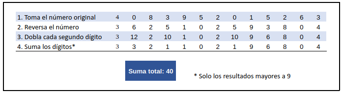
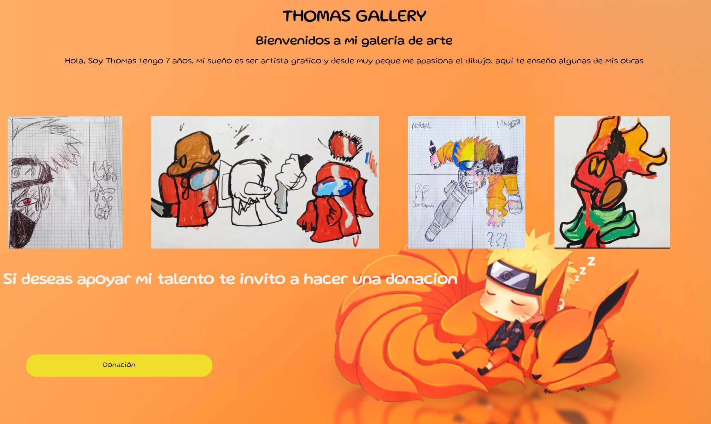
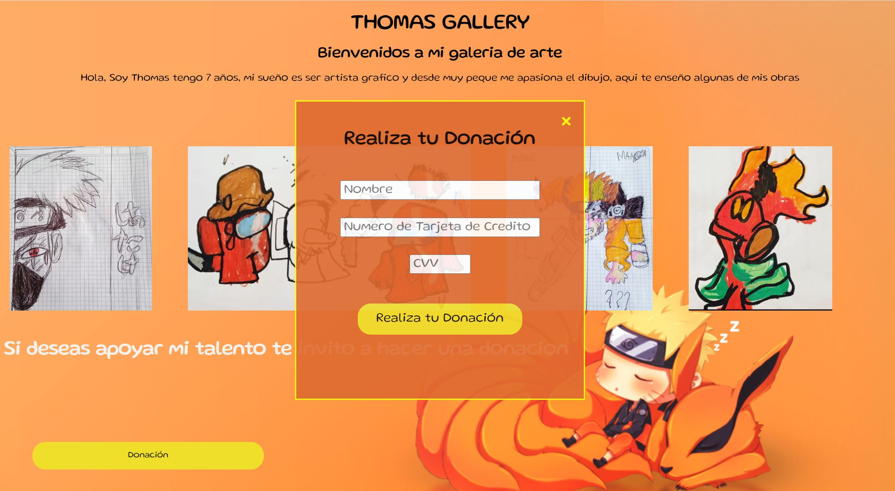
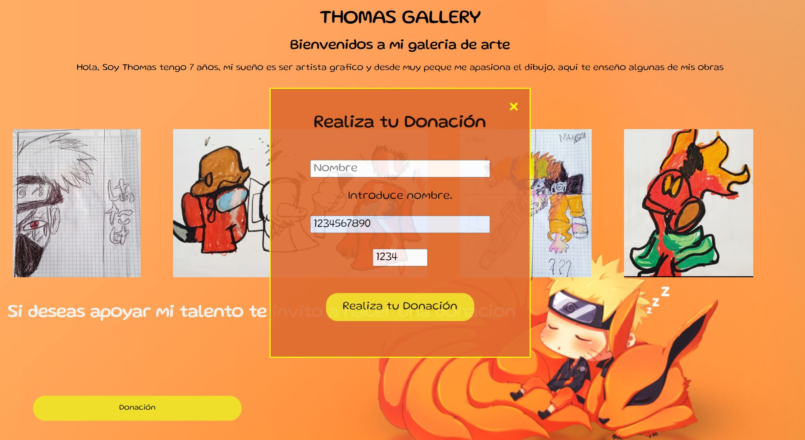
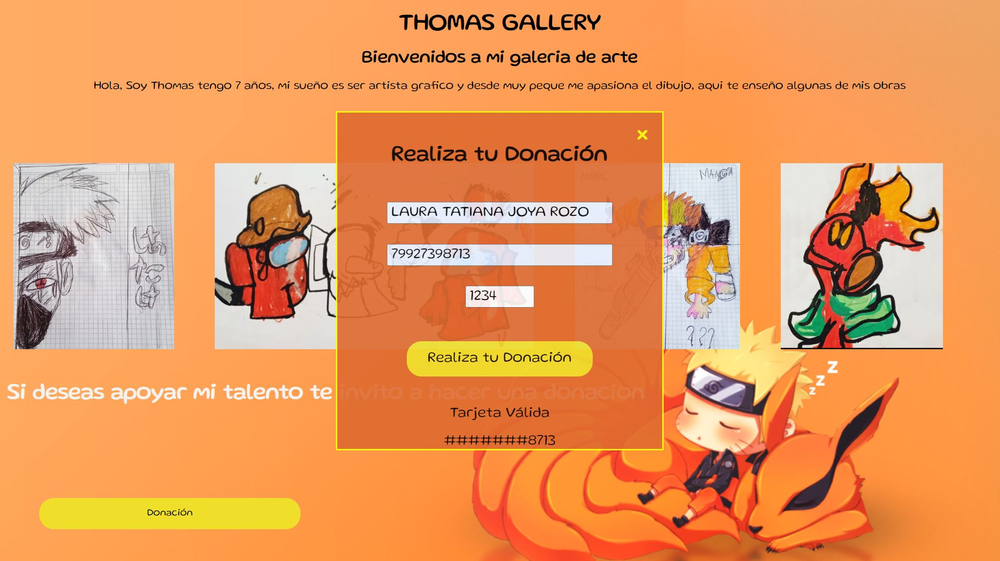

# Thomas Gallery
https://github.com/LauraJoya19/DEV009-data-lovers/assets/133243351/f994df96-f68e-488e-a638-b43f7201fdda
## Indice
* [1. Definición del producto.](#1-definición-del-producto)
* [2. Sobre la aplicacion.](#2-sobre-la-aplicacion)
* [3. Resumen de la interfaz.](#3-resumen-de-la-interfaz)

***

## 1. Definición del producto.

El proyecto es una galeria de arte de un niño de 7 años 
donde exponemos algunos de sus dibujos ya que a su 
corta edad se evidencia que tiene talento. 
Los usuarios pueden hacer donacion en dinero 
donde apoyan el crecimiento artistico del niño.

### 1.1 Principales usuarios. 
 Apasionados por el dibujo, arte, 
 fundaciones que apoyen el talento infantil y 
 filantropos.

### 1.2 Objetivos de los usuarios.
Apoyar el talento infantil, inculcar el arte y ayudar a 
construir un sueño.

### 1.3 Resolucion de problema. 
Muchas veces hemos querido apoyar el talento infantil en 
muchas ramas artisticas y deportivas y por no contar con 
los recursos suficientes y no poder cumplir con 
montos minimos o suscripciones continuas se pierde la 
oportunidad de apoyar a los pequeños.

En Thomas Gallery, los usuarios harian su aporte al 
crecimiento de un artista segun sus recursos disponibles 
de manera directa y estarian constantemente avidenciando 
la inversion de sus recursos.
***
## 2. Sobre la aplicacion. 
* HTML: Use HTML semantico para crear el cuerpo de la 
pagina.
* CSS: Use selectores de CSS, implemente el Box Model 
y di estilo a la pagina.
* DOM: Use selectores del DOM y eventos de escucha.
* Javascript: Use pruebas unitarias, datos primitivos, 
declaracion de  variables, condicionales y bucles para 
dar la  funcionalidad a la interfaz de la siguiente 
manera:
  
  - IsValid: Usando el algoritmo de Luhn o algoritmo del 
  módulo 10, que comúnmente se utiliza para validar 
  tarjetas de credito de la siguiente manera: Se ingresa 
  el numero de la tarjeta de credito, se obtiene la 
  reversa del número ingresado; a los números en posición 
  par se les multiplica por dos y si este número es mayor 
  o igual a 10, debemos sumar los dígitos del resultado; 
  el número a verificar será válido si la suma de sus 
  dígitos finales es un múltiplo de 10.

    
  
  -  Maskify: Enmascaramos los numeros de la tarjeta de credito a excepcion de los cuatro ultimos digitos.
  ***
## 3. Resumen de la interfaz
El usuario al ingresar ve un pagina con la informacion 
general e imagenes del artista, 

Se encuentra un boton llamado "Donación" que al 
dar click en el nos muestra una ventana modal la cual 
contiene el formulario con los datos para la validacion 
de la tarjeta y realizar la respectiva donacion.

Si al ingresar los datos algun campo queda vacio aparecera
un mensaje indicando que campo quedo vacio y hasta no 
diligenciarlo no podra continuar.

Una vez nuestro formulario este completo nos muestra si 
la tarjeta es valida o invalida y los numeros 
enmascarados.

